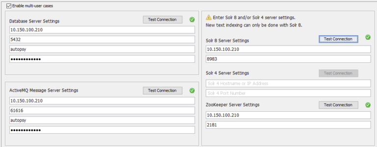

# Autopsy multiuser "server"

This respository contains all of the necessary files to run a multiuser server for Autopsy. 

## Installation
- Start by cloning the repository to your local machine. 
- Edit the .env file to include the correct values for your environment.
- Run `docker-compose up -d` to start the server.

## Setup
Get SOLR version :
```bash
SOLR_VERSION=$(cat .env | grep SOLR_VERSION | awk -F= '{print $2}')
```

Create a Solr collection for Autopsy :
```bash
docker exec -it autopsy-solr bin/solr create_collection -c autopsy -d /tmp/SOLR_${SOLR_VERSION}_AutopsyService/solr-${SOLR_VERSION}/server/solr/configsets/AutopsyConfig/conf
```

## Usage
Start by mapping the samba share to a network drive on you computer.

Then, open Autopsy and go to `Tools (toolbar at the top) > Options > Multi-user` and configure the server settings.



Replace the IP with your server ip/dns

## Credits
Inspired by [this](https://github.com/CptOfEvilMinions/Autopsy-Automation/tree/main) and by this blog post [Getting started with Autopsy multi-user cluster](https://holdmybeersecurity.com/2021/05/11/getting-started-with-autopsy-multi-user-cluster/)